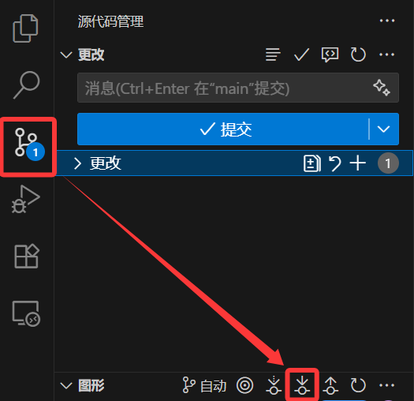
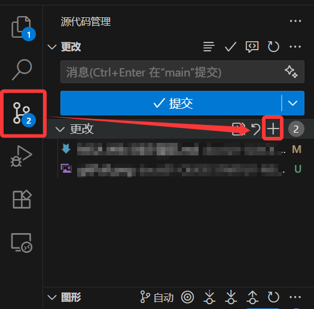
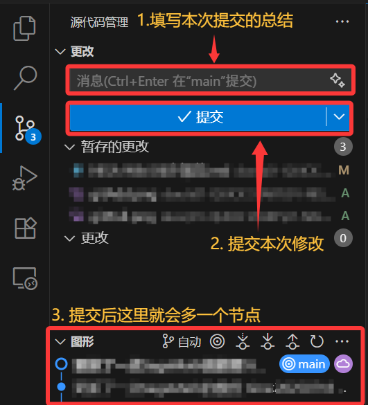
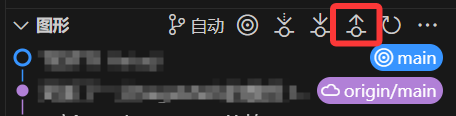
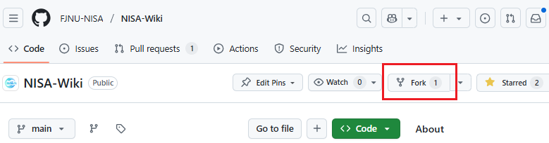
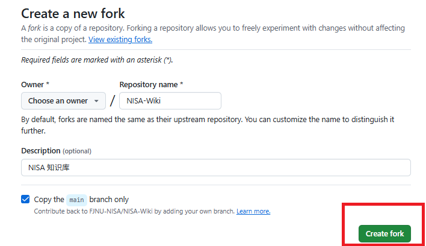
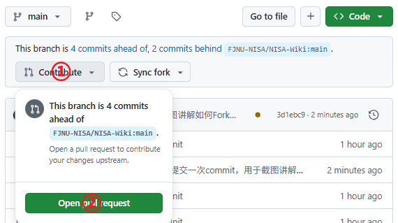
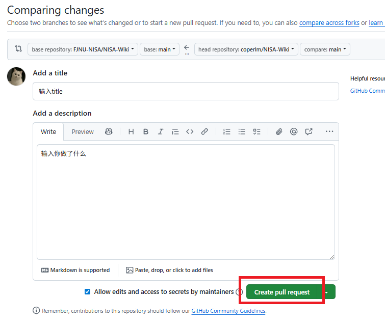

# NISA Wiki 同步规范

本文以 Windows 下, 使用 [VScode](https://code.visualstudio.com/) 为环境来演示

## Clone-克隆

在确保安装 git 与可以正常访问 Github 后, 在一个合适的存储路径, 运行如下命令

```bash
git clone https://github.com/FJNU-NISA/NISA-Wiki
```

如果顺利的话, 这时会下载下来一个 `NISA-Wiki` 命名的文件夹

## 拉取-Pull

如果你刚刚克隆下仓库, 那么你本地的 Wiki 版本不出意外就是最新的(不排除你刚克隆就有人更新仓库), 那么你可以不用在执行拉取操作

但是当你长时间没有同步你的本地 Wiki, 那应该先执行 Pull 指令, 以确保你的本地 Wiki 与云端 Wiki 版本统一

### 命令操作

下面是一条简单的 Pull 指令例子, 你可以直接对本仓库执行, 以同步最新的版本(如果想学习更详细的 Git 命令可以前往相应的页面学习)

```bash
git pull origin main
```

### VScode 操作

当然在 VScode 中也是可以图形化操作的, 如下图所示



## 编写-Write

这里推荐使用 [VScode](https://code.visualstudio.com/) 作为编辑工具, 其有较好编写 Markdown 和 操作 git 仓库的环境, 下文

具体内容规范请看 [NISA Wiki 编写规范](./NISA Wiki 编写规范.md)

## 上传-Push

当你编写完 Wiki 后, 想要同步到云端就需要使用 Push 命令

### 命令操作

如下, 这个是一个简单的 push 命令, 可以直接将本地的文件同步到云端中(如果想学习更详细的 Git 命令可以前往相应的页面学习)

```bash
git push origin main
```

直接运行这条命令, 你会得到 `Everything up-to-date` 的回显

你以为全部同步上去了? 其实并没有, 因为在 push 之前, 你还需要运行 add 和 commit 命令

push 只是把当前本地的 git 节点同步云, 但是没有运行 add 和 commit 命令之前, 并未有新的 git 节点

所以要先运行如下命令, 建立 git 节点

```bash
git add 要添加修改的文件名1
... 省略多个add命令
git add 要添加修改的文件名n

git commit -m "提交信息"
```

> 如果想直接 add 所有的修改文件, 可以直接运行 `git add .`

对于 `提交信息` 填写的内容则是对上述 add 文件修改了什么内容的总结

在 add 和 commit 之后, 就可以继续执行 push 命令了

### VScode 操作

而这些命令, 如果在 VSCode 中将会特别简单

add 命令相当于点击下图位置(如果是要单独 add 一个文件, 则点击文件的 `+` 即可)



然后就是 commit 命令



最后就是上传云端, 注意云朵的标志, 是当时已经上传云端的位置



## 最后提示

请遵守以下行为:

1. 不要频繁的 commit, 尽可能确保一次完整的修改后在进行 commit
2. commit 的消息请认真填写, 不要填写无意义的内容


## 协作者的操作

上述内容全部是仓库主的操作。但咱不是，又但是咱想改的话，直接Fork然后提Pr即可

先打开仓库主页，点击右上角的Fork（star也可以顺便点一下bushi



然后会让你在自己的github账户下，复制这样一个仓库，直接点击`Creat fork`即可



这样子，你就在自己的这个仓库有了最高权限，可以任意修改——正如同协会的仓库主掌握原仓库（即你刚刚Fork的那个）一样

后面操作跟着上面的教程，更改并提交到github对**你自己账户下的这个仓库的更改**即可

下面，讲如何Pr，即`Pull Request`

首先打开你原本Fork并且进行更改的仓库，点击`Contribute`，然后点击`Open pull request`



下拉可以看到你更改了哪些内容，如果内容确定无误，就可以输入你做了什么的介绍，然后点击`Create pull request`，即可成功提交Pr，等待仓库主审核即可



温馨提示，由于很多人会对仓库进行更改，所以主仓库的版本可能会领先于你Fork的版本，可以直接点击`Sync Fork`进行同步（此操作相当于重新Fork覆盖一遍你原本的仓库，所以你的更改可能会被覆盖，请做好备份）


