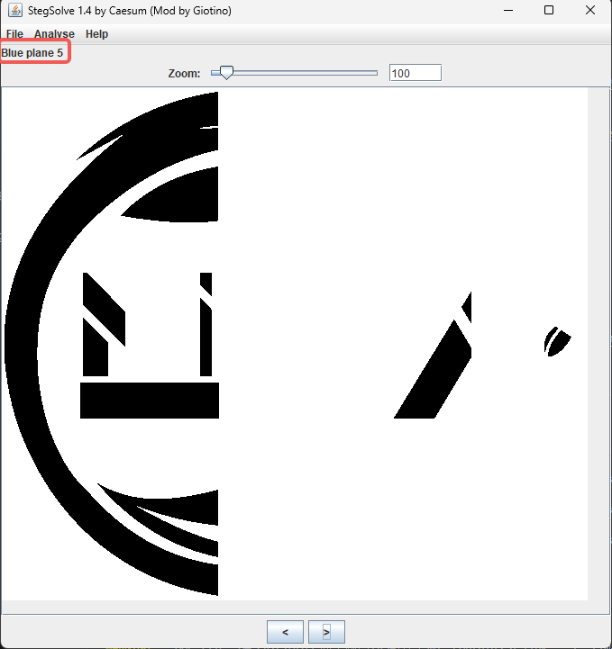
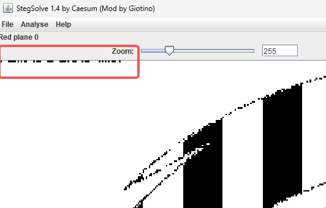
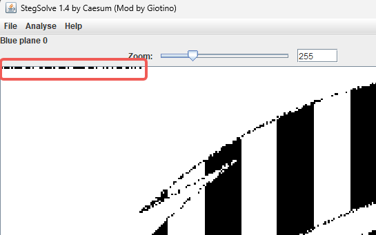
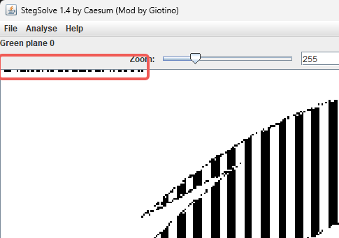
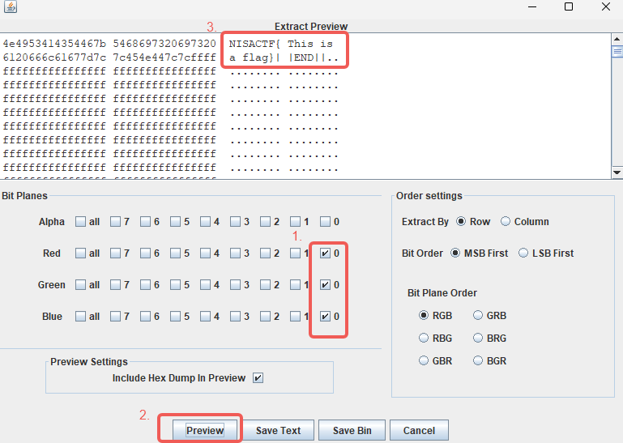

# LSB 隐写

## 原理详解

LSB 即 Least Significant Bit Steganography，最低有效位隐写，它的核心思想是利用数字媒体文件（如图像、音频或视频）中数据的冗余性，将秘密信息隐藏在其中，而人眼或人耳通常无法察觉其存在。

要理解LSB，首先需要了解数字颜色是如何存储的。在数字图像中，每个像素的颜色通常由三个值表示：红（Red）、绿（Green）和蓝（Blue），即我们熟知的RGB模型。每个颜色通道的强度通常用一个8位的字节（即0-255的整数）来表示。

一个8位的字节看起来像这样：`11010110`

- 最高有效位 (Most Significant Bit, MSB): 左边的第一位（1），它的改变会对整个数值产生最大的影响。

- 最低有效位 (Least Significant Bit, LSB): 右边的最后一位（0），它的改变对整个数值的影响微乎其微。

例如，数字 214 的二进制是 11010110。如果我们改变它的LSB（从0变为1），它就变成了 11010111，即十进制的 215。对于一个像素的某个颜色通道来说，从214变为215，其颜色上的变化是人眼完全无法分辨的。

如果对多个像素进行利用，就获取了多个比特位的存储空间，在这些空间中就可以存储需要隐写的数据。

## 例题讲解 

题目如下

### 寻找隐藏数据

完成 LSB 隐写的题目需要使用 [SteSlove工具](../../../01-QUICK%20START/03-常用工具使用指南/StegSolve/index.md)

使用 [SteSlove工具](../../../01-QUICK%20START/03-常用工具使用指南/StegSolve/index.md) 打开图片，通过下方的按钮选择当前图片显示使用的通道

比如，当前只使用 `Blue plane 5` 通道进行显示图片

在改变显示通道的时候，注意观察图片显示的变化，发现异常的通道，隐写数据可能就存在这些通道中

在这题中，可以在 `Blue plane 0`，`Red plane 0`，`Green plane 0` 中发现异常

隐写的数据应该就是存放在这里面

### 解码隐藏数据

确定隐写数据存储的通道后，尝试解码数据。进入 [SteSlove工具](../../../01-QUICK%20START/03-常用工具使用指南/StegSolve/index.md) 的 Analyse -> Data Extract 功能界面

选择上文发现的可以通道，然后预览，即可发现隐写数据

## 题单

!!! tip "温馨提示"
    适当的练习是巩固和提高的重要途径之一

- [2025MoeCTF-ez_LSB](https://ctf.xidian.edu.cn/training/22?challenge=896)