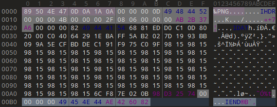
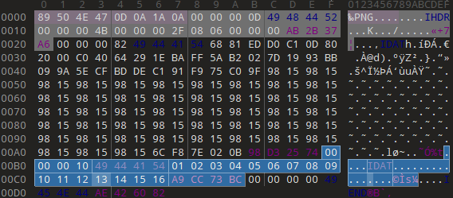
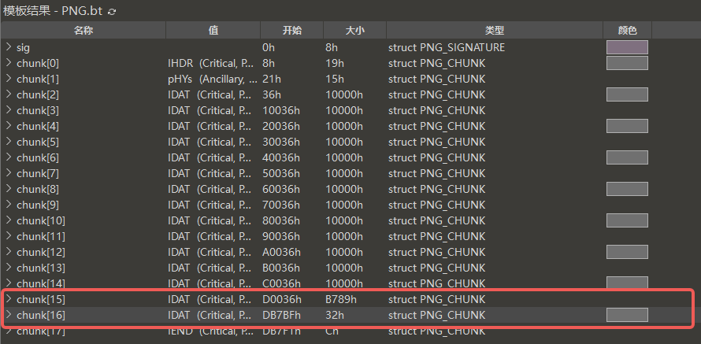
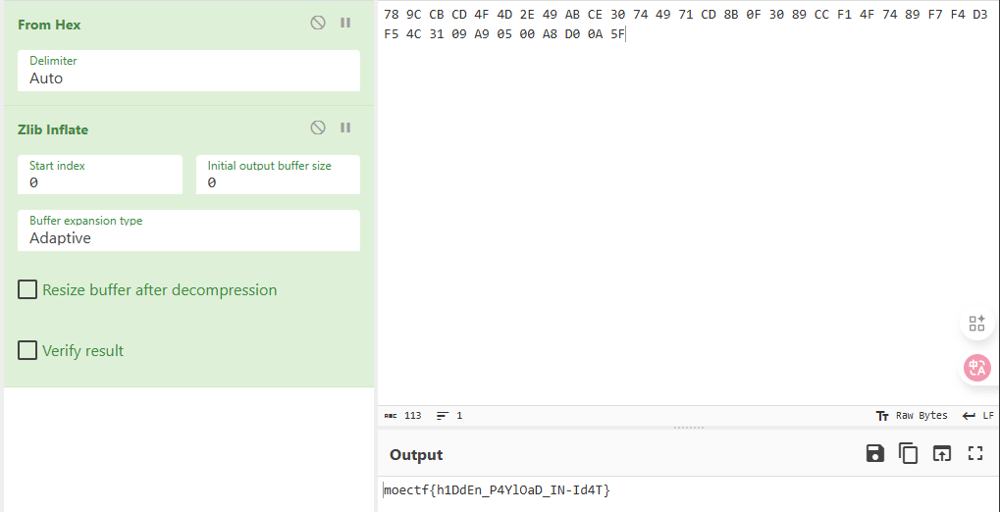

# PNG-IDAT 隐写

## 原理详解

!!! note "提示"
    可以先去学习一下 `PNG 文件结构`，下文只会简单讲解 `PNG 文件结构`

### PNG 的数据块 Chunk 

以下是几种关键数据块，PNG-IDAT 隐写主要涉及到 IDAT 块

- IHDR (Image Header)：图像头数据块。它包含了图像的基本信息，如宽度、高度、颜色深度、颜色类型等。它必须是 PNG 文件中的第一个数据块。
- IDAT (Image Data)：图像数据块。它存储了实际的图像数据，也就是构成画面的像素信息。一个 PNG 文件可以包含一个或多个 IDAT 块。
- IEND (Image End)：图像结束数据块。它标志着 PNG 文件的结束。

其中数据块包括 `块长度`，`块类型`，`块数据`，`CRC字段`

### 隐写方式

1. 首先，需要一张正常显示的 PNG 图片，保留能够解码出完整图像的原始 IDAT 块。如下
    
2. 接着，在最好一个 IDAT 块与 IEND 块之前填上一个新的 IDAT 块
    
3. 对于新增的 IDAT 块，可以在数据段中插入内容，并不会影响图片正常显示，比如上图中数据段为 `01 02 03 04 05 06 07 08 09 10 11 12 13 14 15 16`

## 例题讲解 [2025MoeCTF-ez_png](https://ctf.xidian.edu.cn/training/22?challenge=861)


!!! info "题目信息"
    这张平平无奇的图片里藏着一个小秘密。

    秘密不在颜色中，而在文件的骨骼里。

    注意：某些数据段的长短似乎不太协调。

通过题目的提示，可以知道这道题应该不是 [LSB隐写](./LSB隐写.md)

### 找到隐写数据

通过关键字 “文件的骨骼”，尝试使用 [010 Editor](../../../01-QUICK%20START/03-常用工具使用指南/010%20Editor/index.md) 打开文件

然后可以发现，倒数第二个 IDAT 块并没有写满，就写了最后一个 IDAT 块，由此可以推断，最后一个 IDAT块应该是人为添加的



所以提取最后一个可疑的 IDAT 块，数据为 `78 9C CB CD 4F 4D 2E 49 AB CE 30 74 49 71 CD 8B 0F 30 89 CC F1 4F 74 89 F7 F4 D3 F5 4C 31 09 A9 05 00 A8 D0 0A 5F`

### 解码数据

发现其开头为 `78 9C`（ZLIB 格式标识）, 可能为ZLIB 压缩数据流，尝试使用 [CyberChef](../../../01-QUICK%20START/03-常用工具使用指南/CyberChef/index.md) 进行解压数据流，恰好解出 Flag



当然页可以通过 Python 等脚本实现

```python
import zlib

# 原始的十六进制字符串
hex_string = "789CCBCD4F4D2E49ABCE30744971CD8B0F3089CCF14F7489F7F4D3F54C3109A90500A8D00A5F"

# 1. 将十六进制字符串转换为字节对象
compressed_data = bytes.fromhex(hex_string)

# 2. 解压缩数据
decompressed_data = zlib.decompress(compressed_data)

print("Hex Result:", decompressed_data.hex())

try:
    print("Text Result:", decompressed_data.decode('utf-8'))
except UnicodeDecodeError:
    print("Text Result: Decompressed data is not valid UTF-8 text.")
```

## 题单

!!! tip "温馨提示"
    适当的练习是巩固和提高的重要途径之一

- [2025MoeCTF-ez_png](https://ctf.xidian.edu.cn/training/22?challenge=861)