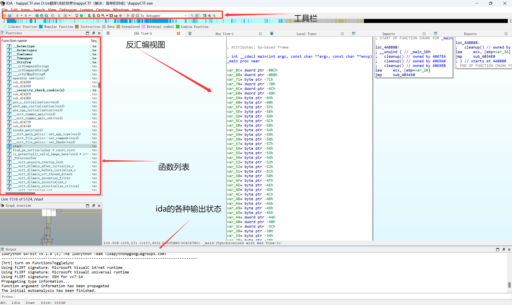
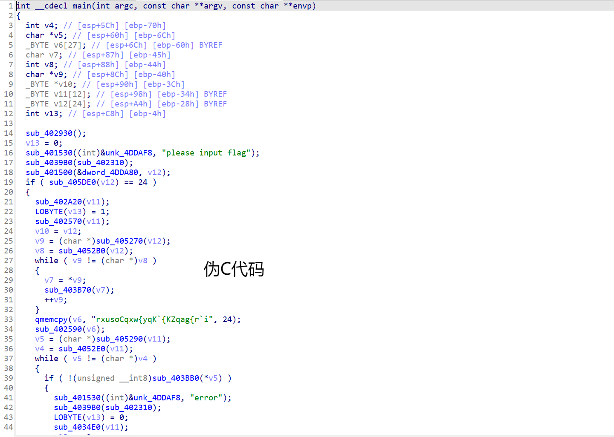
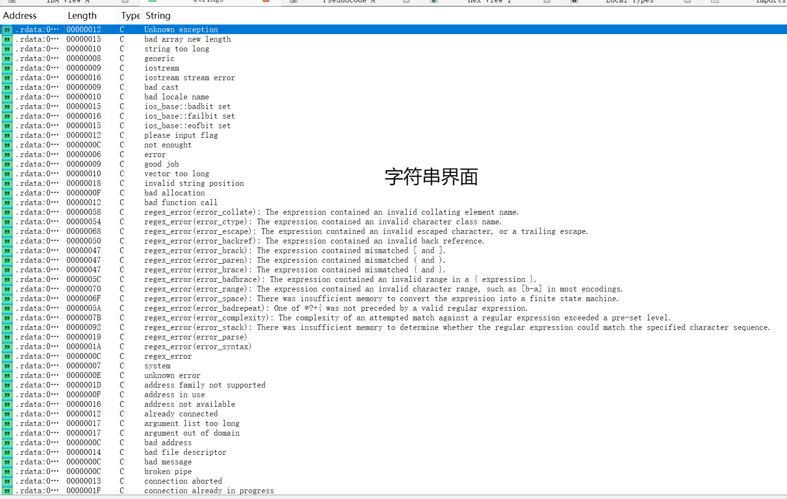
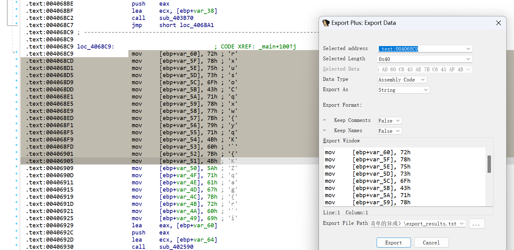
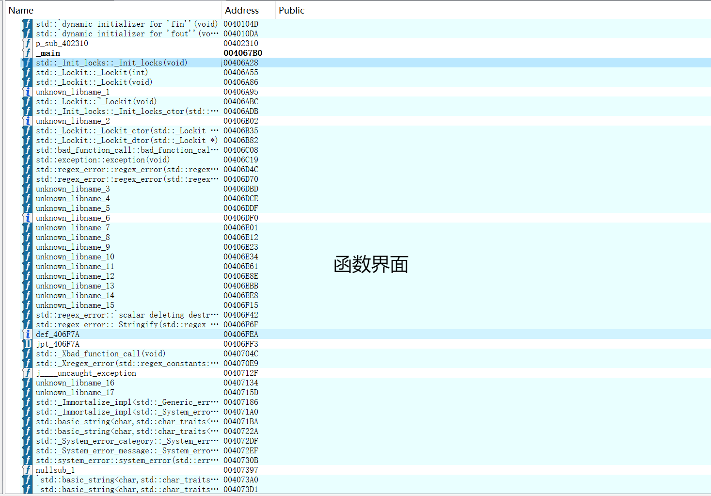
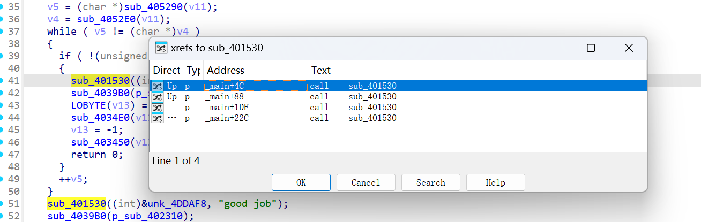
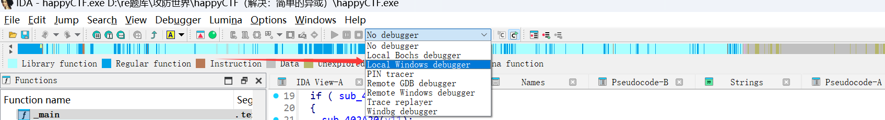
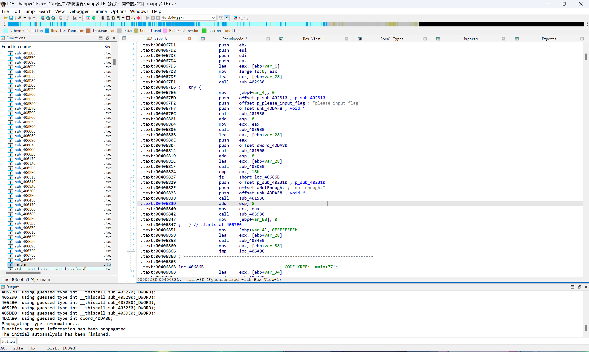
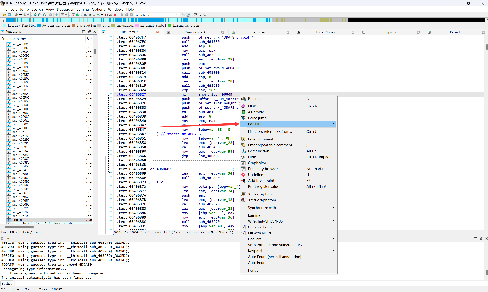
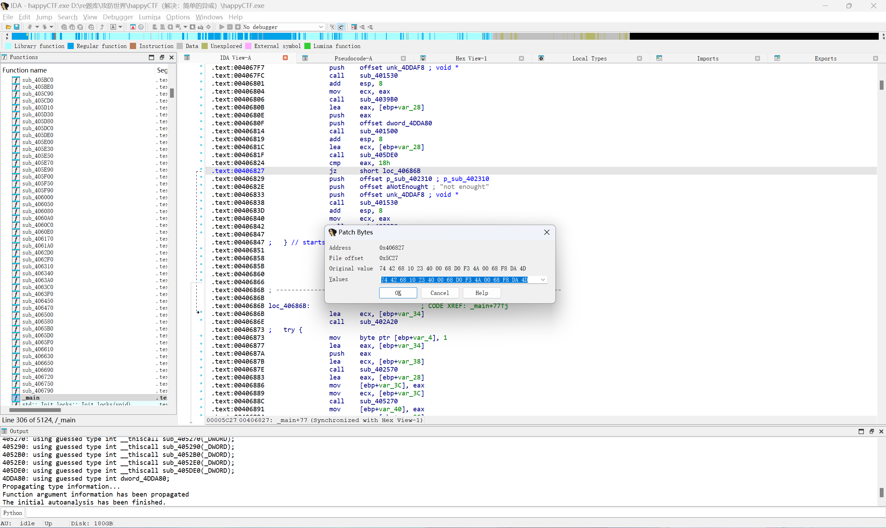

# PC逆向

PC逆向，也可以说是传统逆向，主要是在逆向一些在计算机上运行的软件，与之相对的是移动逆向，详情请看移动逆向篇。

## 准备工作

在开始学习逆向前，我们需要下载一些必要的工具：  
1.IDA Pro，这是一款强大的反编译软件，由于计算机是不能直接运行高级语言，它需要把二进制的文件编译为高级语言。  
作为一个普通的人类，很难直接从二进制文件中看出一个程序的运行逻辑，所以我们需要一个可以把二进制文件转换成我们可以看的懂的语言的软件，IDA Pro就是这样一款软件。  
2.查壳工具，常见的有Die等，"壳"在后面的阻碍逆向的手段中会更详细的讲述，这里可以简单理解为一种妨碍逆向的手段，而查壳工具可以一键分析一个程序是否带有这样的东西，同时可以看一个文件是什么样的文件类型。
3.编程软件，常用的有pycharm，vscode等，用来写一些逆向脚本。
有了这三个，你就可以尝试做一些简单的逆向题目了！  
但是逆向工程的工具远不止这两个，后续将在各种方向中介绍各种题目需要的工具。  

## exe文件逆向

在本板块中，我们将学习如何使用ida来解决附件为exe文件的逆向题目。
附件为exe文件的逆向题目是新手最常见的题目，可以包括的知识点很多，如:壳，花指令，加密算法，反调试，这些都放在阻碍逆向的手段里面，这里主要介绍ida的使用。

### IDA的基本使用

我使用的是攻防世界中一道名为happyCTF的题目，将附件拖到ida中，打开之后如下图所示:  
  
接下来介绍一些常用的快捷键:  
F5:很重要的快捷键，可以将汇编代码转换成伪C代码，极大的方便了我们的分析  
  
shift + F12:可以调出字符串窗口  
  
shift + E:可以将选中的数据提取出来(在提取一些密文的时候比较好用)  
  
shift + F4:可以调出函数Name窗口  
  
X:选中函数按X可以查看交叉引用（可以看是哪个函数调用了当前函数）
  
Tab:可以将伪C代码转回汇编代码  
空格:在汇编代码界面，可以转换视图格式  
ctrl + F:在Name，字符串窗口等界面可以进行搜索操作  
Alt + B:可以进行二进制搜索  
G:在代码页按下可以跳转到输入地址  
\/:可以为指定代码行添加注释  
F8:在调试中进行单步步入 
R:可以将选中的十六进制转成ascii码（在可见字符范围内）
待补充......  

### 动态调试

接下来介绍一种非常常用的逆向手段——动态调试，有人说，逆向玩的就是调试，可见其重要性。  
所谓动态调试，就是让程序跑起来看，面对一些非常大的程序，靠静态分析会非常麻烦，但是使用动态调试有时就可以让你忽略掉一堆无关紧要的函数，清楚的看懂程序是如何运行的。  
在ida中，动态调试一个exe文件的具体操作方法如下:  
首先，点击ida上方工具栏的"no debugger"右侧的小箭头，选择"local windows debugger"选项。  
  
然后点击变绿色的三角形就可以进入动态调试模式了。  
调试的操作在C语言中应该会进行学习，这里不再赘述。  
另外x32dbg,x64dbg同样也是用来进行动态调试的，我们将在脱壳板块介绍这个软件的使用。

### patch

也就是“补丁”的意思，本质上是对程序的修改，假如要破解一款游戏，只是看看是不可能让你的角色变得“天下无敌”的，这时候我们就需要进行打“补丁”来达到我们的目的。  
在CTF中，我们通常通过patch手段来绕过反调试或者更改一些数值来进行解题。
在ida中，我们需要在汇编代码界面来进行patch操作，如何进入汇编代码界面参考前文的快捷键，界面如下图所示:
  
我们首先要选中要修改的汇编代码，右键选择Patching，再点击里面的change bytes就进入了patch界面了
  
  
patch需要一些基础的汇编知识，这里介绍一小部分，我们经常修改的汇编代码以及其对应的操作码:
```
	jz 74  //如果真则跳转
	jnz 75  //如果假则跳转
	jmp EB  //跳转
	call E8 //调用函数
	nop 90  //什么都不做
```
在上文的patch界面，我们可以看到前两个数为74，这便是jz的操作码，只要我们把74转换成75，便可以改变这个程序的逻辑。  
更改完之后我们还需要将其进行保存才能生效，还是选中一行代码，右键选择Patching，点击里面的Apply patches to，你可以选择保存在当前文件或者另存为别的文件。  

## elf文件逆向

## Python逆向

## Net逆向

## Unity逆向

## Vm逆向

## js逆向

## go逆向

## 阻碍逆向的手段

### 壳与脱壳

### 花指令

### 反调试

### 加密算法

### 编码
