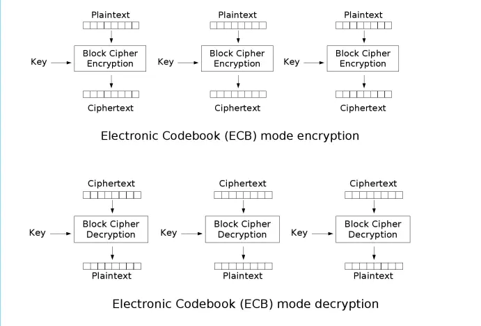
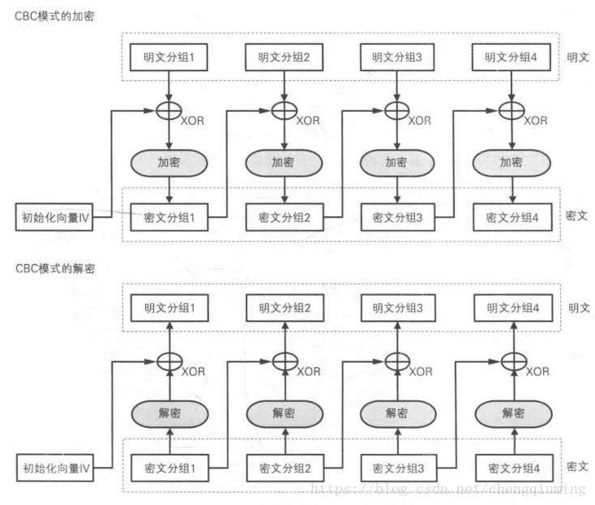

# 简介

对称加密\(Symmetric Key Encryption)可以分为  **分组加密和序列加密**

分组加密: **将明文分组, 加密运算后得到密文组, 密文组经过解密运算可以明文**
代表性算法有: **DES AES 3DES**

# 常见的工作模式

分组密码具有的安全问题, 使用相同的的秘钥, 导致频率特征泄露

## ECB模式(Electronic Code Book)

明文分组后, 每一组秘钥加密和解密

## CBC模式

有限的传播错误
**密文和IV长度一致**

## DES加密

特征: 
- **初始置换IP表**
- 秘钥长度为8字节
- 分组长度为8字节
- IV长度为8字节
- 输出长度对齐为8字节倍数
- 16轮的秘钥加密

## AES加密

特征: 
- **S盒**
- 秘钥的长度为16/24/32字节
- 分组长度为16字节
- IV长度为16字节
- 输出长度对齐到16字节倍数

