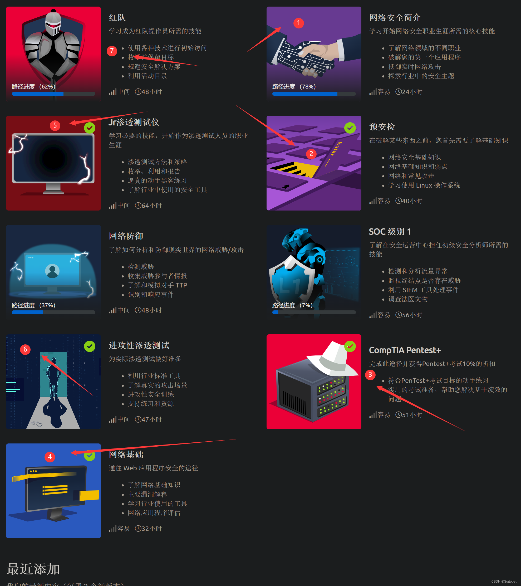

# TryHackMe

一个很好用的学渗透网站

## 简介

`TryHackMe` 是一个面向网络安全学习者的在线靶场平台，以任务导向、结构清晰著称。它通过将复杂的渗透测试知识拆解为一个个可交互的学习模块，让初学者可以循序渐进地掌握技能。每个模块通常包含教程、在线实验环境和答题挑战，用户无需自行搭建靶机，只需通过浏览器或VPN连接平台提供的虚拟环境，即可开始练习。

`TryHackMe` 涵盖的内容非常广泛，从基础的Linux命令、网络协议、安全工具（如Nmap、Burp Suite）到进阶的漏洞利用、Web渗透、红队蓝队对抗等一应俱全。

## 关于VIP

绝大多数的情况下，VIP的好处在于可以无限时长的使用在线的 `attackbox`，避免了由于福州网络问题导致VPN难以链接的问题

少部分的靶场，比如内网部分，会需要VIP

去咸鱼购买比官网划算很多

## 路径选择

参考[sugobet的CSDN博客](https://blog.csdn.net/qq_54704239/article/details/129238989)

对于零基础，可以先完成 1、4、2、3，然后再有顺序的学习5、6、7

否则可以直接从5、6、7有顺序的开始学习

## `Rooms`

可以参考[noone的博客](https://noone40404.github.io/tags/THM/)